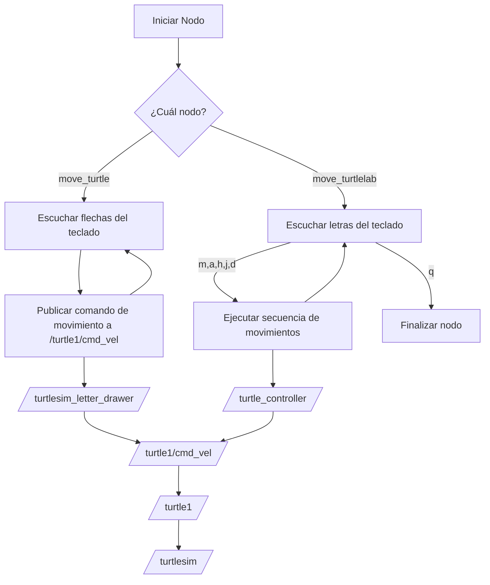

# Lab_01_Robootica_Intro_a_ROS
## Proyecto: Control de Tortuga en Turtlesim

## Integrantes del Grupo

- **Juan David Meza Criollo**
- **Andrés Mauricio Avilan Herrera**

## Descripción general

Este proyecto consiste en controlar una tortuga en el simulador `turtlesim` usando Python y ROS2.  
Se implementaron dos modos principales de control:

- **Control manual** usando las flechas del teclado (↑ ↓ ← →) para mover la tortuga.
- **Dibujo automático** de letras basadas en las iniciales de los nombres de los integrantes del equipo, pulsando teclas específicas (en minúscula).

El objetivo principal fue desarrollar un único script que gestionara completamente el movimiento de la tortuga, sin depender de `turtle_teleop_key`.

---

## Procedimiento realizado

1. **Control manual**:
   - Se detectan las teclas de flechas:
     - ↑ (flecha arriba): avanzar hacia adelante.
     - ↓ (flecha abajo): retroceder.
     - → (flecha derecha): girar hacia la derecha.
     - ← (flecha izquierda): girar hacia la izquierda.
   - Cada flecha genera un `Twist` publicado en `/turtle1/cmd_vel`.

2. **Dibujo automático**:
   - Pulsando letras minúsculas específicas se dibujan letras sobre el entorno:
     - `m` → Dibuja la letra **M**.
     - `a` → Dibuja la letra **A**.
     - `c` → Dibuja la letra **C**.
     - `j` → Dibuja la letra **J**.
     - `d` → Dibuja la letra **D**.
     - `h` → Dibuja la letra **H**.
   - Cada función de dibujo utiliza comandos de movimiento y rotación (`move`) para crear las formas deseadas.

---

# my_turtle_controller

Este paquete de ROS 2 permite controlar una tortuga en el simulador **Turtlesim** de dos maneras:

- **Mediante las flechas del teclado** (control manual en tiempo real).
- **Mediante letras específicas** que ejecutan trayectorias predefinidas para dibujar las letras **M**, **A**, **H**, **J** y **D**.

## Instalación

Clona el repositorio dentro de tu `workspace/src` y compílalo:

```bash
cd ~/ros2_ws/src
git clone <url_del_repositorio>
cd ~/ros2_ws
colcon build
source install/setup.bash
```

## Estructura del Paquete

```
my_turtle_controller/
├── my_turtle_controller/
│   ├── __init__.py
│   ├── move_turtle.py        # Nodo para control con flechas
│   └── move_turtlelab.py      # Nodo para dibujo de letras
├── setup.py                  # Configuración del paquete
├── package.xml               # Información del paquete para ROS
└── README.md                 # Documentación del proyecto
```

## Ejecución

Antes de correr los nodos, abre el simulador:

```bash
ros2 run turtlesim turtlesim_node
```

Luego ejecuta uno de los siguientes nodos:

- Para mover la tortuga con **flechas**:

```bash
ros2 run my_turtle_controller move_turtle
```

- Para dibujar **letras** presionando teclas:

```bash
ros2 run my_turtle_controller move_turtlelab
```

## Estructura de Archivos

- `setup.py`: Define la configuración del paquete y registra los scripts de los nodos.
- `move_turtle.py`: Nodo que permite mover la tortuga usando las flechas del teclado.
- `move_turtlelab.py`: Nodo que permite dibujar letras mediante combinaciones de movimientos de la tortuga al presionar teclas específicas.

---

## Explicación del Funcionamiento

### `move_turtle.py` - Control por Flechas

Este nodo:
- Publica mensajes `Twist` en el tópico `/turtle1/cmd_vel`.
- Escucha las teclas presionadas (`arriba`, `abajo`, `izquierda`, `derecha`) usando hilos y terminal en modo cbreak.
- Asocia cada flecha a un movimiento lineal o angular de la tortuga:
  - ↑ (Arriba): Avanza.
  - ↓ (Abajo): Retrocede.
  - → (Derecha): Gira a la derecha.
  - ← (Izquierda): Gira a la izquierda.

### `move_turtlelab.py` - Dibujo de Letras

Este nodo:
- Permite al usuario presionar teclas específicas (`m`, `a`, `h`, `j`, `d`) para que la tortuga dibuje letras en pantalla.
- Cada letra tiene su propia **secuencia de movimientos** programada (combinación de translaciones y rotaciones controladas).
- Usa hilos para escuchar la entrada del teclado sin bloquear el hilo principal de ROS.

---

## Diagrama de Flujo interno del Sistema


